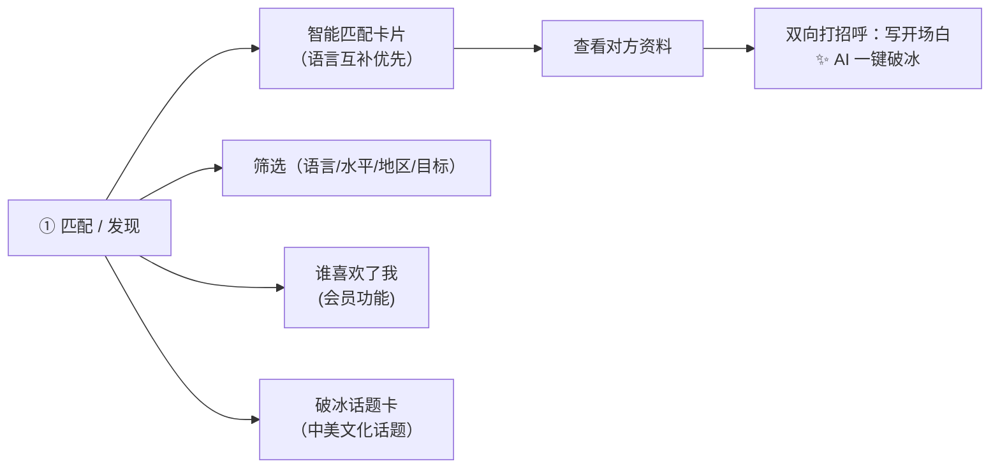
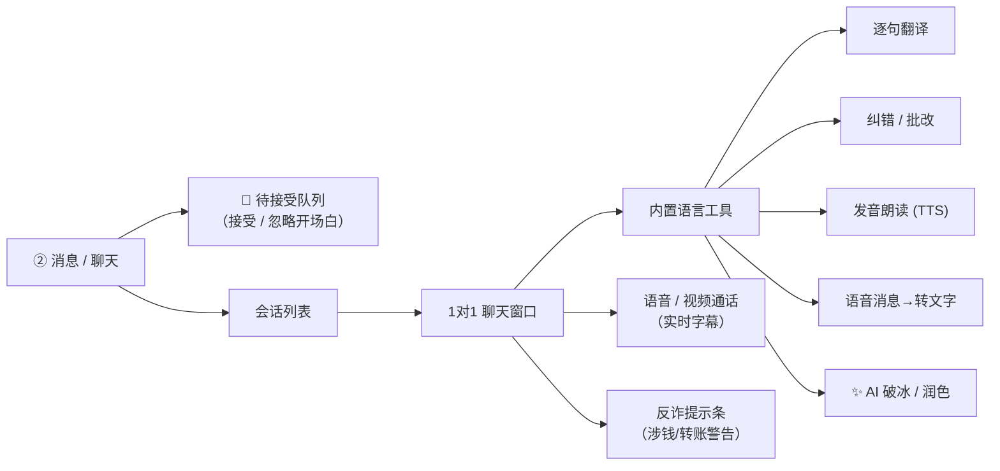
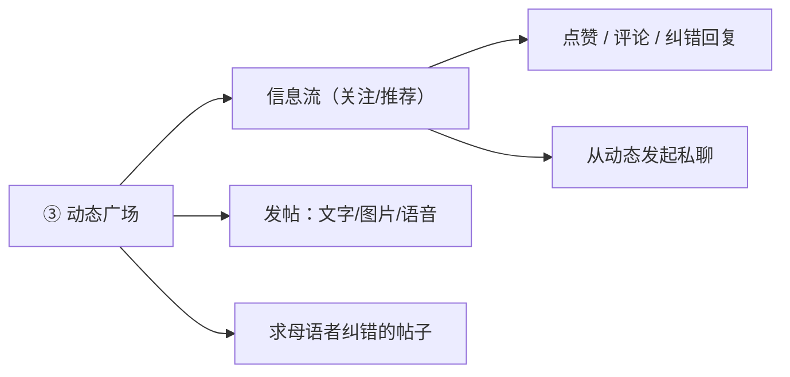
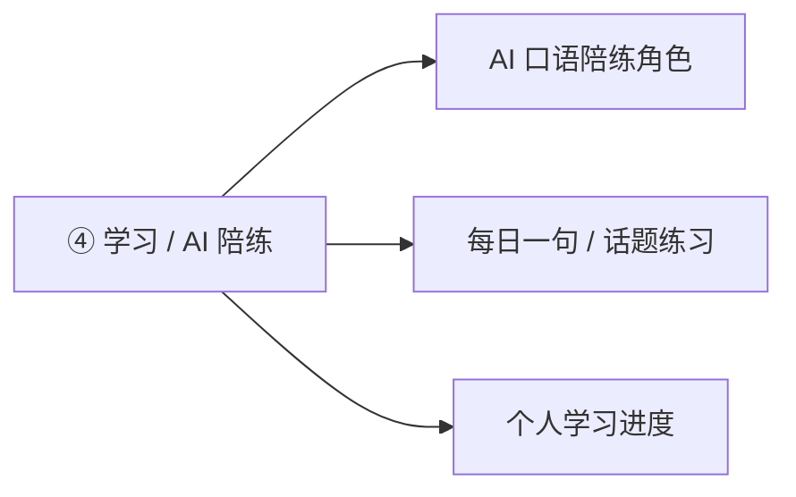
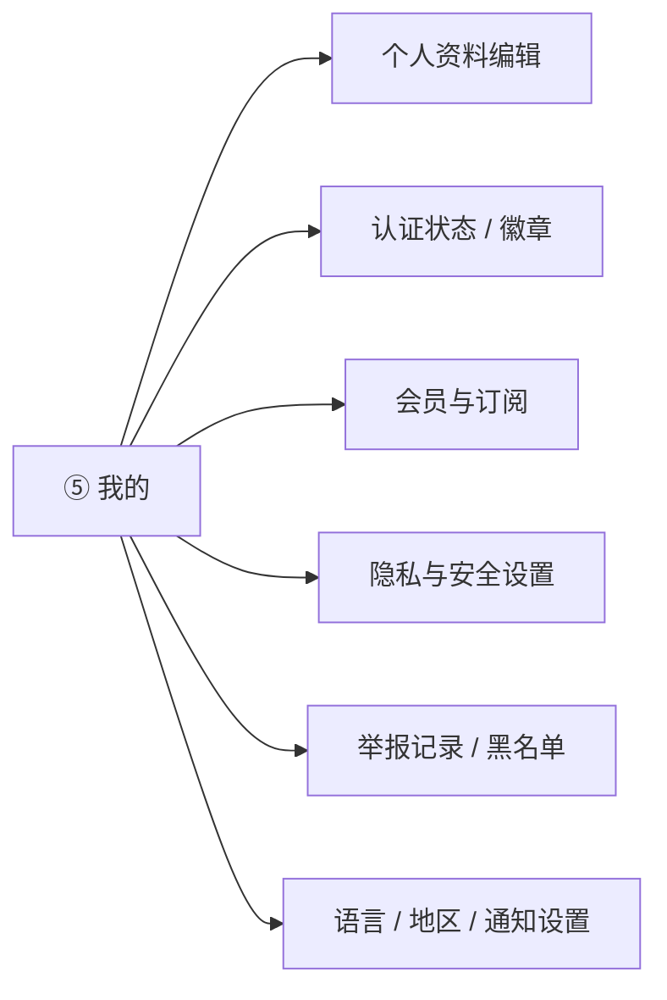
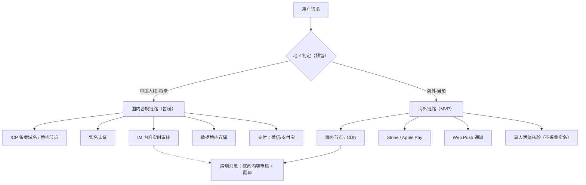

# TalkLov · 信息架构（Information Architecture）

> 产品定位：以「语言交换」为正当入口，用「自然交友」做留存与情感黏性，约会是自然结果而非招牌。
> 目标用户：美国人（男性居多）＋ 中国人（女性居多）。
> 域名 / 品牌：talklov.com / TalkLov
> 平台形态：PWA（可添加到主屏幕，无需上架应用商店）。
> 覆盖范围：MVP 面向海外优先（talklov.com）；合规、反诈、受保护的双向建会话作为第一优先级。中国实名 / ICP 备案作为将来开关。

---

## 1. 顶层信息架构（App 整体结构地图）

这张图展示整个产品有哪些「大区块」，以及它们之间的关系。底部是登录后的 5 个主 Tab。

```mermaid
graph TD
    Root["TalkLov PWA"]

    Root --> Public["未登录区（公开）"]
    Root --> Auth["认证与准入流程"]
    Root --> App["登录后主应用"]
    Root --> System["系统与合规层<br/>（贯穿全局）"]

    %% 公开区
    Public --> Landing["落地页 / 产品介绍"]
    Public --> AddHome["添加到主屏幕引导<br/>(PWA 安装)"]
    Public --> SignIn["登录 / 注册入口"]

    %% 认证准入
    Auth --> Register["注册（手机验证码优先 · 一号一账号）"]
    Auth --> Verify["真人活体核验（不采集实名）"]
    Auth --> Profile["建立资料<br/>（母语/目标语/兴趣/口音）"]
    Auth --> Onboarding["偏好设置<br/>（找语伴/交朋友/看缘分）"]

    %% 主应用 5 大 Tab
    App --> TabMatch["① 匹配 / 发现"]
    App --> TabChat["② 消息 / 聊天"]
    App --> TabMoments["③ 动态广场 (Moments)"]
    App --> TabLearn["④ 学习 / AI 陪练"]
    App --> TabMe["⑤ 我的 / 设置"]

    %% 系统层
    System --> Safety["反诈与安全中心"]
    System --> Report["举报 / 拉黑 / 申诉"]
    System --> Notif["通知（Web Push）"]
    System --> Payment["订阅与支付<br/>(海外Stripe；国内将来)"]
    System --> Compliance["合规层（将来开关）<br/>(内容审核/实名/数据分区)"]
```

---

## 2. 五大主 Tab 的下钻结构

### ① 匹配 / 发现

### ② 消息 / 聊天（核心护城河）

### ③ 动态广场（Moments，留存引擎）

### ④ 学习 / AI 陪练（解决冷启动没人聊）

### ⑤ 我的 / 设置

---

## 3. 权限与准入分层（谁能做什么）

用「渐进式信任」控制风险：越敏感的操作，要求越高的认证等级。**注册墙放在"打招呼"、认证墙放在"聊天前"**，让游客可免注册浏览与匹配。

| 用户状态 | 浏览/匹配 | 看完整资料+清晰照片 | 点赞/打招呼 | 自由私聊 | 视频 | 发动态 |
|---|---|---|---|---|---|---|
| **T0 游客（未注册）** | ✅ | ✅（防搬运水印/限流；可选仅登录可见） | ❌（点击即弹注册） | ❌ | ❌ | ❌ |
| **T1 轻账号（已注册未认证）** | ✅ | ✅ | ✅（男方每日 5 条开场白；女方不限） | ❌（接受后进会话前需认证） | ❌ | ⚠️ 限量 |
| **T2 真人认证** | ✅ | ✅ | ✅ 无限 | ✅ | ✅ | ✅ |
| 会员订阅 | ✅ | ✅ | ✅ 无限 + 高级筛选 | ✅ | ✅ | ✅ |

> 两道墙：**注册墙 = 想点赞/打招呼时**（T0→T1）；**认证墙 = 首次进入会话/聊天前**（T1→T2，仅真人活体，不采集实名）。
> 游客可像 Bumble/FB Dating 一样看清晰照片与完整资料，只是不能先打招呼；配合防搬运措施与可选隐私开关。
> **受保护的双向建会话**：任一方都能发开场白；首次接触需对方「接受」后才自由聊；AI 一键破冰降摩擦；男方每日配额防刷屏；开场白长期有效、不设倒计时。

---

## 4. 合规与数据分区（将来开关 · MVP 暂缓）

> **MVP 决策**：面向海外优先（talklov.com），只做真人活体核验，**不采集证件实名、暂不申请 ICP**。中国大陆强监管链路（备案 / 实名 / 数据境内化 / 境内支付）保留为将来开关，架构预留地区判定。

