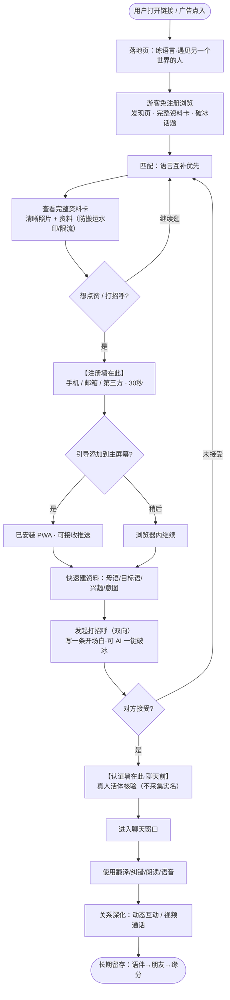
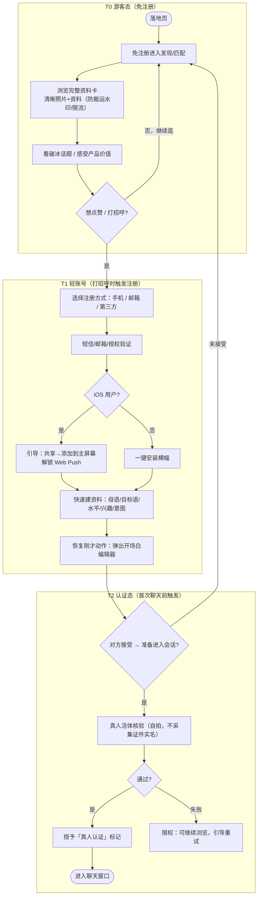
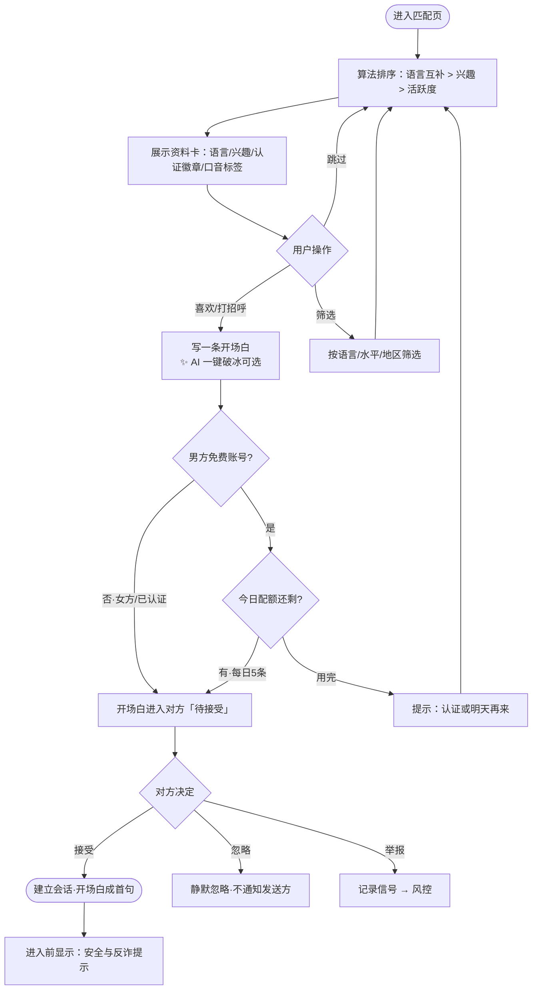
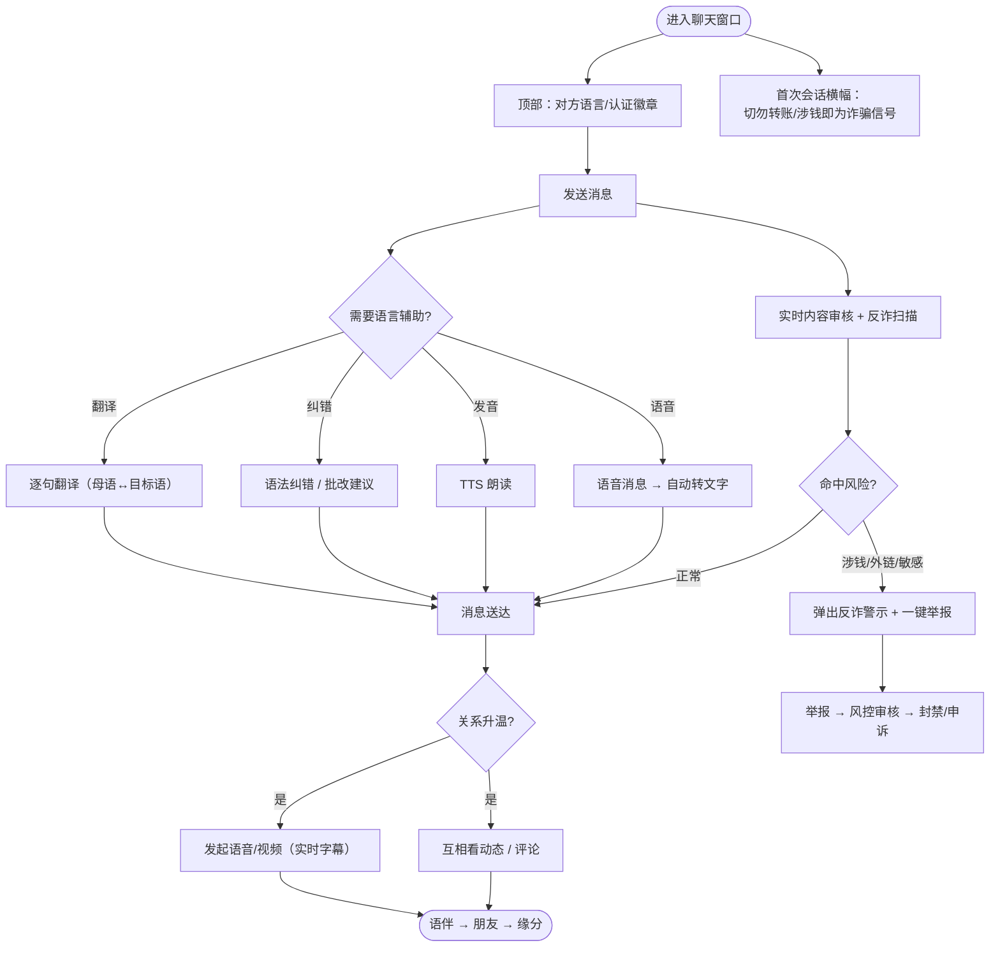
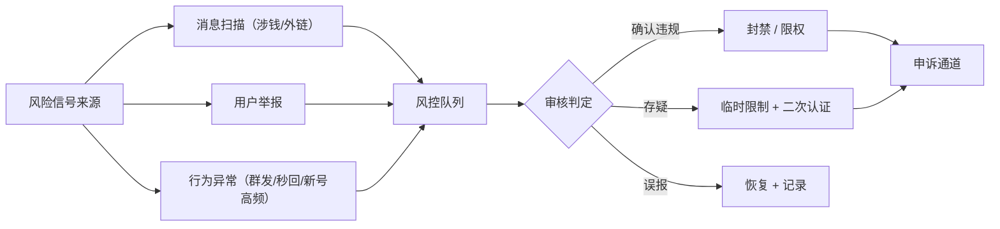

# TalkLov · 用户流程图（用户从落地到聊天的完整路径）

> 本文档拆成 4 段来看：
> A. 端到端总览（一眼看懂全流程）
> B. 渐进式注册（先浏览/匹配，打招呼时才注册，聊天前才认证）
> C. 匹配 → 建立会话（受保护的双向 + AI 破冰）
> D. 聊天体验（语言工具 + 反诈安全）
>
> **核心原则：注册墙尽量往后挪。** 让新用户先免注册浏览并感受价值，只在"点赞/打招呼"这个高意愿动作时才弹注册，把最重的真人认证推迟到"首次聊天前"。
>
> **机制取向（针对美中跨国调优，非纯 Bumble）：** 任何一方都能发起，但首次接触只能发**一条开场白、需对方接受**；用 **AI 一键破冰**消除女性语言焦虑，用**男方每日配额**防刷屏；跨国时差下**开场白长期有效、不设倒计时**。MVP 只做真人活体核验，**不采集证件实名**（中国实名/ICP 备案作为将来开关）。

---

## A. 端到端总览：从打开到聊起来（渐进式注册）

> 两道墙的位置是关键：**注册墙 = 想打招呼时**；**认证墙 = 首次聊天前**。浏览和匹配全程免注册。

---

## B. 渐进式注册：三级漏斗（先浏览 → 打招呼注册 → 聊天前认证）

目标：**把摩擦按价值兑现程度分层**，越重的验证推到用户意愿越强的时刻，最大化上手转化，同时守住防骚扰与真人信任。

**关键设计说明**
- **注册墙在"打招呼/点赞"这个高意愿动作时才出现**，游客可全程免注册浏览完整资料与匹配（含清晰照片），最大化上手转化。
- **认证墙推迟到"首次聊天前"**：只做真人活体核验（不采集证件实名）。中国实名 / ICP 备案作为将来开关。
- **开放浏览 + 防搬运**：游客可看清晰照片与完整资料（对齐 Bumble/FB Dating 的信息量），但只能看不能打招呼；同时用隐形水印、图片懒加载/不暴露直链、访问限流来防批量爬取。
- **可分级的照片隐私开关**（用户可自选）：默认公开 →「仅登录用户可看」→ 未来可升级「仅**认证**用户可看」。信任等级越高、可见范围越可收紧，给谨慎用户明确退路。
- iOS 的 Web Push 必须先「添加到主屏幕」，所以在注册后立即引导安装。
- 认证失败不踢人，退回可浏览的限权态并引导重试，避免流失。

---

## C. 匹配 → 建立会话（受保护的双向 + AI 破冰）

针对美中跨国场景调优：**不做纯 Bumble「女方强制先开口」**，也不设 24 小时倒计时。

**为什么这样设计**
- 「美国男多、中国女多」的结构极易变成男性刷屏、女性被骚扰后流失的死亡螺旋——**唯一的安全墙**是：陌生人首次接触只能发一条开场白，需对方接受后才自由聊。
- 但纯 Bumble「女方必须先开口」在美中赛道弊大于利：国内女性有语言焦虑，美区男性预期「被追求」被挫败，12–15 小时时差让 24h 倒计时失效。
- 因此采用**受保护的双向**：任一方都能发起；女方靠「AI 一键破冰 + 只需接受」零焦虑；男方靠「每日 5 条」防刷屏；开场白**长期有效、不设倒计时**，把异步当常态。

---

## D. 聊天体验：语言工具 + 反诈安全

这是产品的护城河：让「和陌生人聊天」有正当理由、有工具支撑、且安全。

**关键设计说明**
- 语言工具（翻译/纠错/朗读/语音转文字）内嵌在聊天里，这是 HelloTalk 最强的黏性来源，必须做扎实。
- 每一条跨境消息都经过内容审核 + 反诈扫描；涉钱、外链、诱导转账等直接弹警示并提供一键举报。
- 关系升温后引导到视频（带实时字幕）和动态互动，让「语伴」自然过渡到「朋友」，约会是水到渠成的结果。

---

## 附：反诈与举报闭环（贯穿全局）

